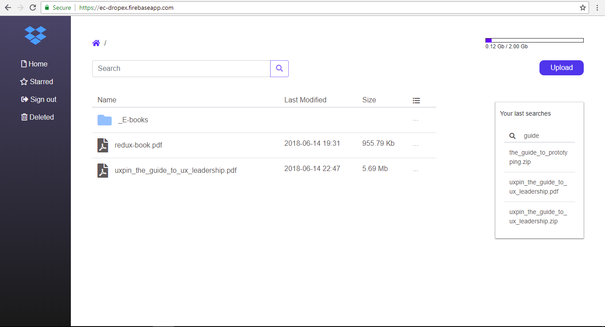

# Dropbox Explorer - DropEx
This project was generated with [Angular CLI](https://github.com/angular/angular-cli) v6.0.8. You may want to know about how you can [start here](ANGULAR.md), view [online demo here](https://ec-dropex.firebaseapp.com/) and [sketchboard](https://sketchboard.me/lA0SWJEBeaSJ#/).

You may want to view about these things in this project:
* [Angular v6.0.4](https://blog.angular.io/version-6-of-angular-now-available-cc56b0efa7a4)  and [RxJS v6.2.0](https://github.com/ReactiveX/rxjs/blob/master/MIGRATION.md)
* [Dropbox API v2](https://www.dropbox.com/developers) - [Dropbox webhooks](https://www.dropbox.com/developers/reference/webhooks)
* [AngularFire2](https://github.com/angular/angularfire2)
* [Firebase Realtime Database](https://firebase.google.com/docs/database/)
* [Firebase Hosting](https://firebase.google.com/docs/hosting/)
* [Cloud Functions for Firebase](https://firebase.google.com/docs/functions/)
* [Google Cloud Platform](https://cloud.google.com/)

## Other repositories used for this project
* [Dropbox webhooks](https://github.com/nguyenkhois/dropbox-webhooks)
* [Angular - Firebase example](https://github.com/nguyenkhois/angular-firebase-example)
* [Angular - Firestore example](https://github.com/nguyenkhois/angular-firestore-example)

## Screenshot

## Using
* You need to change many configs in the file `/src/app/configs.ts` for this app
   * Dropbox config
   * Firebase config
* I will close all my servers or change my configs at any time. This project is only using to learn by youself.

## References
### Guides
* [Express server](https://expressjs.com/en/4x/api.html)
* [List of HTTP status codes](https://en.wikipedia.org/wiki/List_of_HTTP_status_codes)
* [Dropbox files/list_folder behaviour](https://www.dropboxforum.com/t5/API-Support-Feedback/Dropbox-files-list-folder-behaviour/td-p/232948)
* [Firebase CLI Reference](https://firebase.google.com/docs/cli/)
* [Firebase - Call Functions via HTTP Requests](https://firebase.google.com/docs/functions/http-events#using_express_request_and_response_objects)
* [Introduction To Firebase Cloud Functions](https://medium.com/codingthesmartway-com-blog/introduction-to-firebase-cloud-functions-c220613f0ef)
* [Content Security Policy (CSP)](https://content-security-policy.com/)
